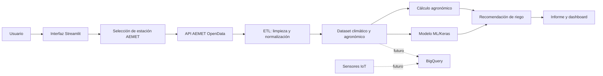
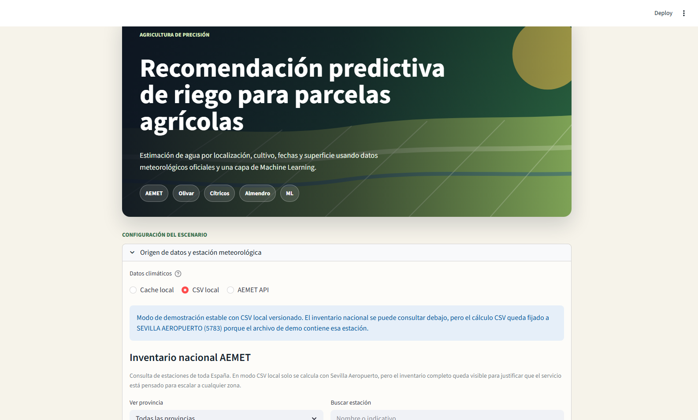
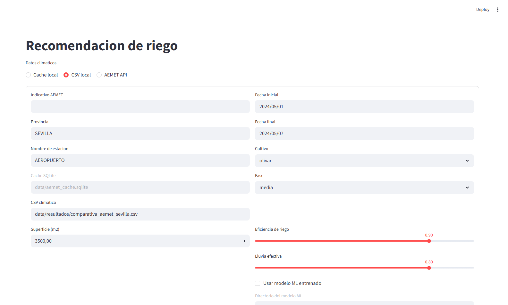
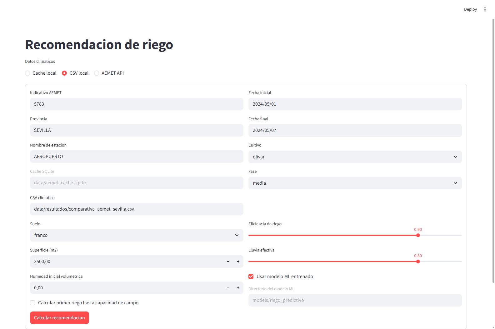
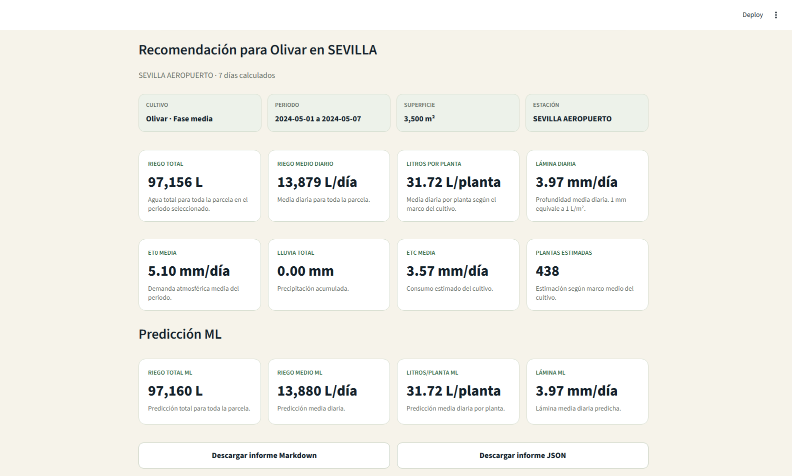
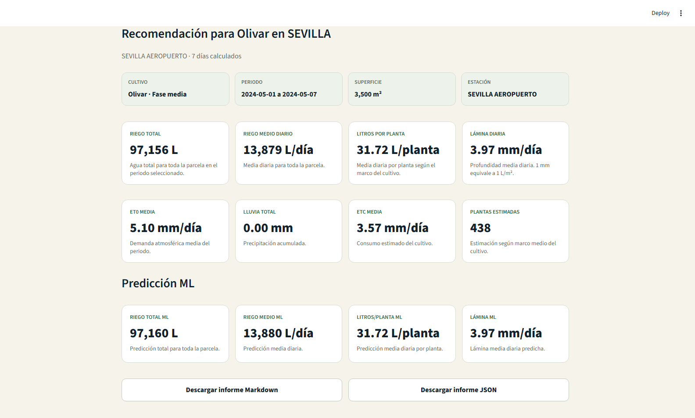
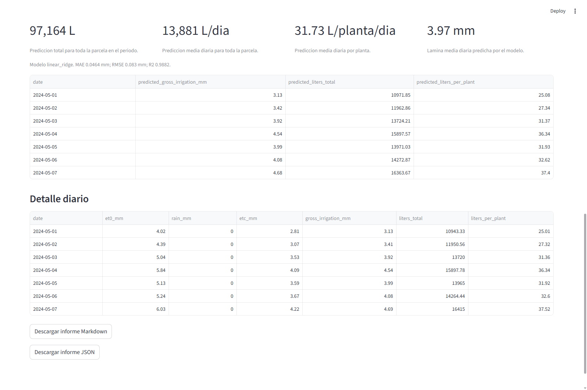
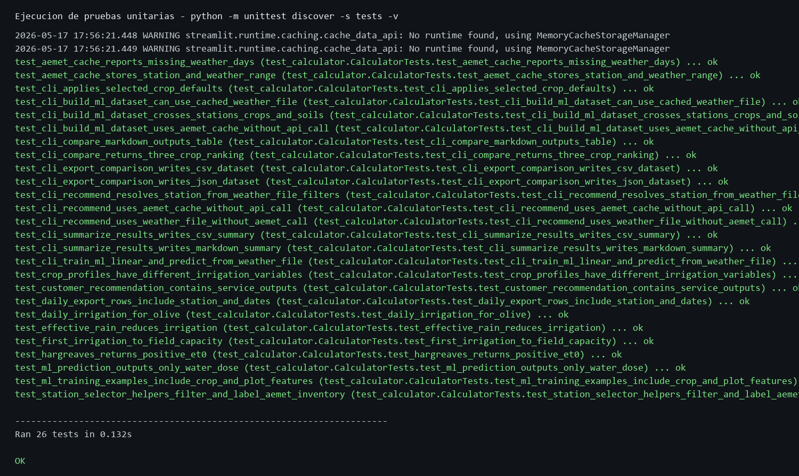
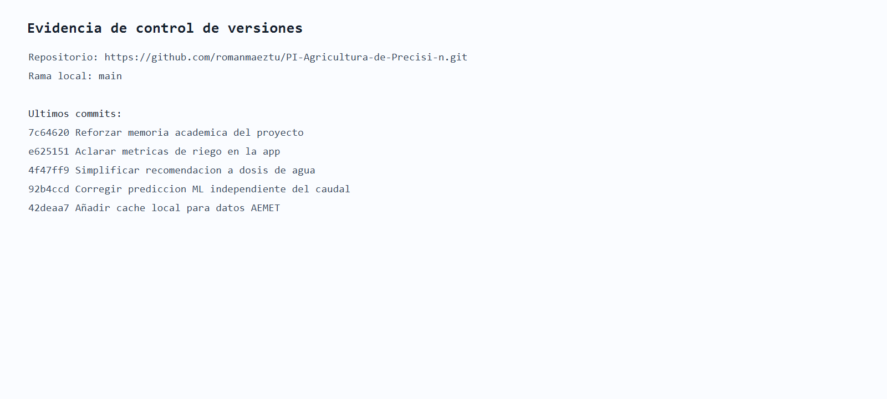

# Proyecto Intermodular

## Sistema predictivo de recomendación de riego basado en AEMET, IoT y Machine Learning

**Alumno:** Roman Maeztu  
**Proyecto:** Agricultura de precisión aplicada a la gestión hídrica  
**Repositorio:** https://github.com/romanmaeztu/PI-Agricultura-de-Precisi-n  
**Fecha:** Mayo de 2026  

> Documento base para revisión académica. Los datos personales del centro y la validación final con el tutor deben completarse antes de la entrega.

## Tabla de contenidos

1. Introducción  
2. Marco teórico  
3. Marco metodológico  
4. Resultados  
5. Conclusiones  
6. Referencias  
7. Anexos  

## 1. Introducción

### 1.1 Idea general del proyecto

El presente Proyecto Intermodular consiste en el desarrollo de un sistema de recomendación de riego para agricultura de precisión. La aplicación permite seleccionar una estación meteorológica de AEMET, definir las características de una parcela y elegir un cultivo. A partir de esos datos, el sistema calcula la dosis de riego recomendada y genera una predicción mediante una capa de Machine Learning.

El objetivo práctico es responder a una pregunta concreta para el usuario final: **cuánta agua debe aplicar en una plantación determinada, durante un periodo concreto, evitando tanto el déficit hídrico como el desperdicio de agua**.

La solución se ha planteado como un servicio predictivo configurable. El usuario puede introducir:

- Zona o estación AEMET.
- Fechas de análisis.
- Cultivo.
- Tipo de suelo.
- Superficie de la parcela.

Con esa información, el sistema calcula litros totales, litros por planta y lámina de riego en milímetros. Además, permite comparar varios cultivos para observar cómo cambia la demanda hídrica en función de sus parámetros agronómicos.

### 1.2 Contexto y justificación

La agricultura mediterránea se enfrenta a un escenario de presión creciente sobre los recursos hídricos. En Andalucía, y especialmente en zonas agrícolas como el Valle del Guadalquivir, el agua disponible para riego es un recurso limitado. Por ello, la toma de decisiones basada únicamente en experiencia o calendarios fijos puede resultar insuficiente.

El proyecto se apoya en datos oficiales de AEMET OpenData, un servicio que permite el acceso programado a datos meteorológicos reutilizables mediante API REST [1]. Esta fuente permite incorporar información diaria de estaciones reales, como temperatura, precipitación y datos climáticos necesarios para estimar la evapotranspiración.

Desde el punto de vista agronómico, el riego se relaciona con la evapotranspiración de referencia, el coeficiente de cultivo y la eficiencia del sistema de riego. La metodología FAO-56 establece una base ampliamente utilizada para calcular necesidades hídricas mediante el enfoque ET0 y Kc [2]. Este proyecto adapta esa lógica a un prototipo software con interfaz y capa predictiva.

### 1.3 Definición del problema

El problema que se aborda es la dificultad de calcular de forma precisa y defendible la cantidad de agua que debe aplicarse a una parcela agrícola. En muchos casos, el riego se realiza mediante criterios generales, turnos fijos o estimaciones poco conectadas con los datos meteorológicos reales.

Esta situación puede producir dos efectos negativos:

- Riego insuficiente, con riesgo de estrés hídrico y pérdida de producción.
- Riego excesivo, con desperdicio de agua, aumento de costes y posible deterioro del suelo.

El proyecto propone una solución tecnológica para estimar la necesidad de riego a partir de datos oficiales, parámetros del cultivo y características de la parcela.

### 1.4 Objetivos

#### Objetivo general

Desarrollar un sistema de análisis de datos basado en información meteorológica, parámetros agronómicos y Machine Learning para optimizar el uso de recursos hídricos en cultivos agrícolas.

#### Objetivos específicos

Los objetivos específicos se plantean como una escalera: cada escalón permite avanzar hacia el objetivo general.

| Escalón | Objetivo específico | Resultado esperado |
|---:|---|---|
| 1 | Diseñar una estructura de captación de datos climáticos y agronómicos. | Definición de variables meteorológicas, edáficas, fisiológicas y de parcela. |
| 2 | Conectar el sistema con datos oficiales de AEMET. | Consulta de estaciones, descarga de datos diarios y transformación a formato utilizable. |
| 3 | Implementar el cálculo agronómico de riego. | Cálculo de ETc, lluvia efectiva, riego neto, riego bruto y litros. |
| 4 | Incorporar varios cultivos configurables. | Comparación entre olivar, cítricos y almendro. |
| 5 | Crear una capa predictiva con Machine Learning. | Entrenamiento de un modelo Keras/TensorFlow para predecir riego bruto. |
| 6 | Desarrollar una interfaz de usuario. | Aplicación Streamlit con selección de estación, cultivo, suelo y parcela. |
| 7 | Preparar el proyecto para almacenamiento masivo. | Estructura de datos compatible con BigQuery para futura explotación cloud. |

### 1.5 Alcance del proyecto

El proyecto se centra en un prototipo funcional. La versión desarrollada permite trabajar con estaciones AEMET de España, con especial validación sobre datos de la estación Sevilla Aeropuerto. La solución no sustituye una auditoría agronómica profesional, pero sí ofrece una base técnica para construir un servicio de recomendación y predicción de riego.

La principal limitación actual es que el modelo de Machine Learning se ha entrenado con datos históricos y etiquetas generadas a partir del cálculo agronómico. Para una operación comercial real, el siguiente paso sería calibrar el sistema con sensores IoT instalados en campo y datos reales de humedad del suelo, producción y riego aplicado.

## 2. Marco teórico

### 2.1 Agricultura de precisión

La agricultura de precisión consiste en utilizar datos, sensores y herramientas digitales para tomar decisiones más ajustadas a las condiciones reales de una parcela. En el caso del riego, esta aproximación permite pasar de calendarios generales a recomendaciones basadas en clima, suelo, cultivo y estado hídrico.

En este proyecto, la agricultura de precisión se concreta en cuatro capas:

- Captación de datos: estaciones AEMET y futura red de sensores IoT.
- Almacenamiento: CSV local y estructura preparada para BigQuery.
- Análisis: cálculo agronómico y modelo predictivo.
- Visualización: interfaz web y reportes exportables.

### 2.2 Datos meteorológicos y AEMET OpenData

AEMET OpenData proporciona acceso a datos meteorológicos oficiales mediante una API REST. El flujo de consulta se compone de dos fases: primero se solicita un recurso mediante API Key y después se utiliza la URL temporal de descarga que devuelve el servicio [1].

El proyecto aplica este flujo a:

- Inventario nacional de estaciones.
- Búsqueda de estaciones por provincia o nombre.
- Descarga de datos diarios por estación y fechas.
- Transformación de temperatura, precipitación y datos climáticos a una estructura interna.

### 2.3 Evapotranspiración, ET0 y Kc

La evapotranspiración representa el agua perdida por evaporación del suelo y transpiración del cultivo. Para estimar necesidades de riego se utiliza la evapotranspiración de referencia, ET0, y el coeficiente de cultivo, Kc. La evapotranspiración del cultivo se calcula como:

```text
ETc = ET0 * Kc
```

El enfoque ET0/Kc es una base habitual en planificación de riego y aparece desarrollado en FAO-56 [2].

Cuando AEMET no proporciona ET0 directamente, el prototipo estima ET0 mediante Hargreaves-Samani, una ecuación basada en temperatura mínima, temperatura máxima, temperatura media y radiación extraterrestre [3]:

```text
ET0 = 0,0023 * (Tmedia + 17,8) * sqrt(Tmax - Tmin) * Ra
```

### 2.4 Suelo y agua disponible

El tipo de suelo condiciona cuánta agua puede retener la parcela. El proyecto utiliza cinco perfiles edáficos:

| Suelo | Capacidad de campo | Punto de marchitez |
|---|---:|---:|
| Arenoso | 0,10 | 0,05 |
| Franco arenoso | 0,15 | 0,07 |
| Franco | 0,25 | 0,12 |
| Franco arcilloso | 0,31 | 0,16 |
| Arcilloso | 0,37 | 0,22 |

Estos valores permiten estimar el agua disponible en el perfil radicular:

```text
Agua disponible total = (capacidad de campo - punto de marchitez) * profundidad radicular * 1000
```

### 2.5 Cultivos seleccionados

El proyecto trabaja con tres cultivos configurables:

| Cultivo | Profundidad radicular | Marco estimado | Agotamiento máximo | Kc en fase media |
|---|---:|---:|---:|---:|
| Olivar | 0,60 m | 8 m2/planta | 0,50 | 0,70 |
| Cítricos | 0,70 m | 20 m2/planta | 0,45 | 0,75 |
| Almendro | 0,80 m | 30 m2/planta | 0,55 | 0,90 |

La elección de estos cultivos permite comparar demandas hídricas diferentes dentro de un contexto agrícola mediterráneo.

### 2.6 Big Data y BigQuery

El proyecto está preparado para evolucionar desde archivos CSV locales hacia una infraestructura de almacenamiento masivo. Google BigQuery es un almacén de datos gestionado orientado al análisis de grandes volúmenes de información [4].

En el contexto del proyecto, BigQuery tendría tres funciones:

- Centralizar históricos meteorológicos de AEMET.
- Almacenar lecturas IoT de humedad, temperatura y conductividad eléctrica.
- Servir como base para consultas analíticas y entrenamiento de modelos.

La versión actual define la estructura de columnas y el flujo ETL, pero la conexión efectiva con BigQuery queda como despliegue cloud posterior.

### 2.7 Machine Learning, TensorFlow y Keras

Machine Learning permite ajustar un modelo predictivo a partir de datos históricos. En este proyecto, el objetivo del modelo es predecir la variable:

```text
riego_bruto_mm
```

TensorFlow proporciona el entorno de cómputo para aprendizaje automático [5], mientras que Keras facilita la construcción de redes neuronales mediante una API de alto nivel [6].

El modelo implementado es una red neuronal multicapa:

- Capa de entrada con variables numéricas y categóricas codificadas.
- Capa densa de 32 neuronas con activación ReLU.
- Capa densa de 16 neuronas con activación ReLU.
- Capa de salida con una predicción continua en milímetros de riego.

Al tratarse de un problema de regresión, la calidad del modelo se evalúa mediante MAE, RMSE y R2. El criterio académico de "precisión superior al 85%" se interpreta como R2 superior a 0,85.

### 2.8 Visualización con Streamlit

Streamlit es un framework de Python orientado a crear aplicaciones web de datos de forma rápida [7]. En este proyecto se utiliza para construir la interfaz del servicio predictivo:

- Selección de fuente de datos.
- Selección nacional de estación AEMET.
- Configuración de cultivo, suelo y parcela.
- Visualización de resultados.
- Activación opcional del modelo ML.

### 2.9 Pruebas unitarias

La validación del prototipo se ha realizado con `unittest`, el framework de pruebas unitarias incluido en Python [8]. Las pruebas comprueban los cálculos principales, los perfiles de cultivos, la exportación de resultados, el entrenamiento del modelo y el selector de estaciones.

### 2.10 Ética, datos y uso responsable de IA

El uso de IA en un sistema de recomendación agrícola debe tratarse como una herramienta de apoyo a la decisión, no como una autoridad absoluta. Las recomendaciones internacionales sobre ética de la IA destacan la necesidad de transparencia, supervisión humana, prevención de daños y responsabilidad en el uso de los datos [10]. En la Unión Europea, el Reglamento (UE) 2024/1689 establece un marco orientado a promover sistemas de IA fiables y centrados en la persona, con atención a la seguridad, los derechos fundamentales y la trazabilidad [11].

Aplicado a este proyecto, esto implica cuatro criterios:

- Explicar de forma clara cómo se calcula la recomendación de riego.
- No presentar la predicción ML como verdad de campo si no está calibrada con sensores reales.
- No publicar claves API ni datos privados de parcelas o usuarios.
- Mantener intervención humana en la decisión final de riego.

## 3. Marco metodológico

### 3.1 Metodología de desarrollo

La metodología elegida ha sido Scrum, adaptada al contexto de un proyecto individual. Scrum permite dividir el trabajo en iteraciones, revisar avances y reajustar prioridades en función de los resultados obtenidos [9].

Aunque no se ha trabajado con un equipo completo Scrum, sí se han aplicado sus principios de desarrollo incremental:

- Definición del objetivo general.
- División en objetivos específicos.
- Desarrollo por bloques.
- Validación técnica después de cada bloque.
- Mejora progresiva del prototipo.

### 3.2 Organización por bloques

El desarrollo se ha organizado en los siguientes bloques:

| Bloque | Trabajo realizado | Relación con objetivos |
|---|---|---|
| 1 | Modelado de cultivos, suelos y parcela. | Base agronómica del proyecto. |
| 2 | Cálculo de riego trazable. | Conversión de clima y parcela en recomendación. |
| 3 | Conexión con AEMET. | Uso de datos oficiales por estación y fechas. |
| 4 | Exportación y resumen de resultados. | Generación de datos defendibles. |
| 5 | Interfaz Streamlit. | Servicio usable por el cliente. |
| 6 | Capa ML/Keras. | Predicción de riego a partir de históricos. |
| 7 | Documentación y repositorio GitHub. | Entrega ordenada y reproducible. |

### 3.3 Herramientas utilizadas

| Herramienta | Uso en el proyecto |
|---|---|
| Python 3.13 | Lenguaje principal de desarrollo. |
| PowerShell | Ejecución de comandos y pruebas. |
| Git y GitHub | Control de versiones y repositorio remoto. |
| AEMET OpenData | Fuente de datos meteorológicos. |
| Streamlit | Interfaz web del prototipo. |
| TensorFlow/Keras | Entrenamiento de la red neuronal. |
| CSV/JSON/Markdown | Exportación de datasets e informes. |
| unittest | Validación automática del código. |
| BigQuery | Capa prevista para almacenamiento masivo. |

### 3.4 Arquitectura propuesta



### 3.5 Proceso ETL con AEMET

El proceso ETL se ha definido en cuatro pasos:

1. **Extracción:** petición GET a AEMET OpenData utilizando una API Key almacenada fuera del código fuente.
2. **Descubrimiento de datos:** lectura de la URL temporal de descarga devuelta por AEMET.
3. **Transformación:** conversión de fechas, precipitación y temperaturas a tipos numéricos homogéneos.
4. **Carga:** generación de un dataset estructurado en CSV y preparación para futura ingesta en BigQuery.

El sistema evita incluir credenciales en el repositorio. La API Key se gestiona mediante la variable de entorno `AEMET_API_KEY` o mediante un archivo `.env` local excluido de Git.

### 3.6 Cálculo de riego

El cálculo agronómico diario sigue esta secuencia:

```text
ETc = ET0 * Kc
lluvia_efectiva = lluvia * 0,80
riego_neto = max(0, ETc - lluvia_efectiva)
riego_bruto = riego_neto / eficiencia_riego
litros_totales = riego_bruto * superficie_m2
litros_por_planta = riego_bruto * marco_m2_por_planta
```

La lluvia efectiva se fija por defecto en el 80 %. La eficiencia de riego se configura por defecto en 0,90 para sistemas de riego localizado.

### 3.7 Entrenamiento del modelo ML

El entrenamiento se realiza a partir de un dataset que cruza:

- Fechas meteorológicas.
- Estación AEMET.
- Cultivo.
- Fase fenológica.
- Tipo de suelo.
- Superficie.
- Variables climáticas.
- Variables agronómicas.

El modelo utiliza como entrada variables numéricas y categóricas. Las variables categóricas se codifican internamente y las numéricas se normalizan. La salida es la lámina de riego bruto en milímetros.

La recomendación se centra en la necesidad hídrica de la plantación: milímetros de riego, litros totales y litros por planta. La forma hidráulica concreta de reparto queda fuera del alcance principal del prototipo.

El dataset utilizado en el prototipo puede considerarse semisintético: los datos meteorológicos proceden de AEMET, pero la etiqueta `riego_bruto_mm` se genera mediante el cálculo agronómico implementado. Esta decisión permite entrenar y validar la capa ML de forma reproducible. La limitación es que el modelo aprende a aproximar el motor agronómico, no una respuesta medida directamente en campo.

### 3.8 Variables aplicadas al cálculo de riego

Para mantener el proyecto centrado en su objetivo principal, la tabla recoge solo las variables que el software utiliza para calcular cuánta agua debe aplicarse a una plantación. No se incluyen variables futuras ni sensores que no intervienen en el cálculo actual.

| Variable | Origen | Uso directo en el cálculo |
|---|---|---|
| Estación AEMET | Selección del usuario | Determina la zona climática de la que se obtienen ET0, lluvia y temperaturas. |
| Rango de fechas | Selección del usuario | Define los días que se calculan y permite obtener totales y medias del periodo. |
| ET0 diaria | AEMET o estimación Hargreaves-Samani | Base climática del cálculo: `ETc = ET0 * Kc`. |
| Lluvia diaria | AEMET | Reduce el riego necesario mediante la lluvia efectiva. |
| Cultivo | Selección del usuario | Selecciona los parámetros agronómicos del cultivo. |
| Fase fenológica | Selección del usuario | Selecciona el valor de Kc que corresponde al estado del cultivo. |
| Kc | Perfil del cultivo | Convierte la ET0 en necesidad hídrica del cultivo. |
| Superficie de la parcela | Entrada del usuario | Convierte la lámina de riego en litros totales: `litros = mm * m2`. |
| Eficiencia de riego | Entrada del usuario | Ajusta el riego neto para obtener el riego bruto que debe aplicarse. |
| Porcentaje de lluvia efectiva | Entrada del usuario | Define qué parte de la lluvia se considera útil para el cultivo. |
| Marco m2/planta | Perfil del cultivo | Convierte la lámina de riego en litros medios por planta. |

El cálculo estándar sigue esta secuencia:

```text
ETc = ET0 * Kc
lluvia_efectiva = lluvia * porcentaje_lluvia_efectiva
riego_neto = max(0, ETc - lluvia_efectiva)
riego_bruto = riego_neto / eficiencia_riego
litros_totales = riego_bruto * superficie_m2
litros_por_planta = riego_bruto * marco_m2_por_planta
```

El tipo de suelo y la humedad volumétrica inicial no forman parte del cálculo diario estándar. Solo se aplican si se activa la opción de calcular un primer riego hasta capacidad de campo. Por eso se consideran variables auxiliares, no variables principales del servicio.

### 3.9 Trazabilidad entre objetivos, metodología y validación

Para mantener coherencia entre lo planteado en la introducción y lo entregado en resultados, cada objetivo específico se vincula con una herramienta, un desarrollo y una forma de validación.

| Escalón | Objetivo específico | Herramientas/datos | Desarrollo realizado | Validación |
|---:|---|---|---|---|
| 1 | Diseñar captación de datos climáticos y agronómicos. | Variables AEMET, suelo, cultivo y parcela. | Definición de modelos de datos y perfiles de cultivo. | Pruebas de perfiles y revisión de variables del dataset. |
| 2 | Conectar con AEMET. | AEMET OpenData y cache local SQLite. | Cliente API, selector nacional de estaciones y ETL. | Descarga por estación/fecha y pruebas con cache. |
| 3 | Implementar cálculo de riego. | ET0, Kc, lluvia efectiva, eficiencia y superficie. | Motor agronómico en Python. | Pruebas unitarias de riego, lluvia y primer riego. |
| 4 | Comparar cultivos. | Olivar, cítricos y almendro. | Comparativa diaria y resumen por cultivo. | Ranking de demanda y exportación CSV/JSON/Markdown. |
| 5 | Crear capa ML. | Dataset AEMET + variables de cultivo/parcela. | Modelo Keras y alternativa lineal. | Métricas MAE, RMSE y R2. |
| 6 | Crear interfaz. | Streamlit. | Formulario de cliente y visualización de resultados. | Prueba funcional en navegador local. |
| 7 | Preparar Big Data. | Estructura compatible con BigQuery. | Columnas exportables y flujo ETL documentado. | Dataset tabular preparado para carga futura. |

### 3.10 Diagrama de Gantt

El siguiente Gantt resume la planificación por semanas. Se presenta como cronograma académico del desarrollo realizado.

| Actividad | S1 | S2 | S3 | S4 | S5 | S6 | S7 | S8 |
|---|:---:|:---:|:---:|:---:|:---:|:---:|:---:|:---:|
| Definición del problema y objetivos | X |  |  |  |  |  |  |  |
| Marco teórico y variables agronómicas | X | X |  |  |  |  |  |  |
| Motor de cálculo de riego |  | X | X |  |  |  |  |  |
| Integración AEMET y ETL |  |  | X | X |  |  |  |  |
| Exportación de datasets y resumen |  |  |  | X | X |  |  |  |
| Interfaz Streamlit |  |  |  |  | X | X |  |  |
| Modelo ML/Keras |  |  |  |  |  | X | X |  |
| Pruebas, memoria y GitHub |  |  |  |  |  |  | X | X |

### 3.11 Cronograma

| Semana | Actividad | Resultado |
|---:|---|---|
| 1 | Definición del problema y objetivos. | Alcance inicial del proyecto. |
| 2 | Diseño de variables de cultivo, suelo y riego. | Perfiles de olivar, cítricos y almendro. |
| 3 | Implementación del cálculo agronómico. | Motor de recomendación validado. |
| 4 | Integración con AEMET OpenData. | Descarga de datos diarios por estación. |
| 5 | Exportación de comparativas y resúmenes. | CSV y Markdown de resultados. |
| 6 | Desarrollo de interfaz Streamlit. | Servicio configurable para usuario. |
| 7 | Implementación de ML/Keras. | Modelo predictivo entrenado. |
| 8 | Pruebas, documentación y GitHub. | Proyecto preparado para entrega. |

### 3.12 ROI y viabilidad económica

No se calcula un ROI monetario cerrado porque faltan datos reales de explotación: consumo histórico de riego tradicional, precio del agua, coste del servicio, coste de sensores y ahorro confirmado en campo. Para evitar estimaciones no justificadas, el proyecto deja definido el método de cálculo:

```text
ahorro_agua_L = riego_tradicional_L - riego_recomendado_L
ahorro_agua_m3 = ahorro_agua_L / 1000
ahorro_economico = ahorro_agua_m3 * precio_agua_m3
ROI = ((ahorro_economico - coste_implantacion) / coste_implantacion) * 100
```

La aplicación ya ofrece la variable necesaria para alimentar este análisis: litros recomendados por parcela, cultivo y periodo. Con datos reales de consumo previo, el ROI puede calcularse sin modificar el sistema.

### 3.13 Presupuesto estimado

| Concepto | Cantidad | Coste unitario | Coste estimado |
|---|---:|---:|---:|
| Horas de análisis y desarrollo | 80 h | 15 EUR/h | 1.200 EUR |
| Equipo informático propio | 1 | 0 EUR | 0 EUR |
| Software libre utilizado | 1 | 0 EUR | 0 EUR |
| Prototipo IoT futuro: microcontroladores | 2 | 20 EUR | 40 EUR |
| Sensores humedad/temperatura suelo | 3 | 25 EUR | 75 EUR |
| Sensor conductividad eléctrica | 1 | 45 EUR | 45 EUR |
| Comunicaciones y alimentación | 1 | 60 EUR | 60 EUR |
| Uso inicial de cloud/BigQuery | 1 | 0-30 EUR | 30 EUR |
| Total estimado |  |  | 1.450 EUR |

El presupuesto distingue entre el prototipo software ya desarrollado y una posible instalación IoT en campo. Las herramientas principales utilizadas son gratuitas o de código abierto.

### 3.14 Gestión ética y licencia del proyecto

La gestión ética del proyecto se aplica en tres niveles:

- **Datos:** se usan datos meteorológicos oficiales y no se publican credenciales ni datos privados de clientes.
- **Modelo ML:** se informa de que la predicción está entrenada sobre datos históricos y etiquetas agronómicas, por lo que requiere calibración antes de operar como recomendación profesional.
- **Usuario:** la interfaz muestra resultados interpretables y mantiene la decisión final bajo supervisión humana.

La memoria, tablas, diagramas y materiales de documentación se proponen bajo licencia Creative Commons Reconocimiento-NoComercial-CompartirIgual 4.0 Internacional (CC BY-NC-SA 4.0) [12]. El código fuente queda vinculado al repositorio académico y, si se libera como software reutilizable, deberá acompañarse de una licencia de software específica.

## 4. Resultados

### 4.1 Funcionalidades implementadas

El proyecto ha conseguido implementar las siguientes funcionalidades:

- Consulta de estaciones AEMET a nivel nacional.
- Filtro de estaciones por provincia y nombre.
- Descarga de datos diarios por estación y rango de fechas.
- Cálculo de ET0 mediante Hargreaves-Samani cuando no se dispone de ET0 directa.
- Configuración de cultivo, fase fenológica, suelo y parcela.
- Comparación entre olivar, cítricos y almendro.
- Exportación de resultados en CSV, JSON y Markdown.
- Interfaz web con Streamlit.
- Entrenamiento de modelo Keras/TensorFlow.
- Predicción de riego bruto mediante Machine Learning.
- Pruebas unitarias automatizadas.

### 4.2 Estructura del repositorio

| Ruta | Función |
|---|---|
| `app.py` | Interfaz web Streamlit. |
| `irrigation_advisor/aemet_client.py` | Cliente de AEMET OpenData. |
| `irrigation_advisor/calculator.py` | Motor de cálculo agronómico. |
| `irrigation_advisor/models.py` | Modelos de datos, cultivos y suelos. |
| `irrigation_advisor/ml.py` | Entrenamiento y predicción ML. |
| `irrigation_advisor/cli.py` | Comandos de consola. |
| `tests/test_calculator.py` | Pruebas unitarias. |
| `data/resultados/` | Resultados generados localmente. |
| `models/` | Modelos entrenados localmente. |

### 4.3 Resultados de comparativa de cultivos

Con datos de la estación Sevilla Aeropuerto para el periodo del 1 al 7 de mayo de 2024, se obtuvo la siguiente comparación sobre una parcela de 10.000 m2:

| Ranking | Cultivo | Días | ET0 media | Lluvia total | Riego total | Riego medio diario | Incremento vs mínimo |
|---:|---|---:|---:|---:|---:|---:|---:|
| 1 | Olivar | 7 | 5,10 mm | 0,00 mm | 277.615,05 L | 39.659,29 L/día | 0,00 % |
| 2 | Cítricos | 7 | 5,10 mm | 0,00 mm | 297.444,70 L | 42.492,10 L/día | 7,14 % |
| 3 | Almendro | 7 | 5,10 mm | 0,00 mm | 356.933,61 L | 50.990,52 L/día | 28,57 % |

El resultado muestra que, bajo las mismas condiciones meteorológicas, el cultivo con menor demanda fue el olivar y el cultivo con mayor demanda fue el almendro. La diferencia acumulada entre ambos fue de 79.318,56 litros.

### 4.4 Resultado orientado a cliente

Para una parcela de 3.500 m2 de olivar en fase media, suelo franco, estación Sevilla Aeropuerto y periodo del 1 al 7 de mayo de 2024, el sistema generó:

| Indicador | Resultado |
|---|---:|
| ET0 media | 5,10 mm/día |
| Lluvia total | 0,00 mm |
| Temperatura media | 17,66 C |
| Riego total del periodo | 97.156,11 L |
| Riego medio diario | 13.879,44 L/día |
| Lámina media diaria | 3,97 mm/día |
| Litros medios por planta | 31,72 L/planta/día |

Este resultado convierte los cálculos técnicos en una recomendación entendible para el cliente.

### 4.5 Resultado del modelo ML/Keras

El modelo Keras se entrenó con un dataset de 168 filas y variables climáticas/agronómicas codificadas. La validación interna obtuvo:

| Métrica | Resultado |
|---|---:|
| MAE | 0,0289 mm |
| RMSE | 0,0381 mm |
| R2 | 0,9975 |
| Filas de validación | 33 |

El modelo supera el umbral del 85 % si se interpreta la precisión como R2 en un problema de regresión. No obstante, este dato debe presentarse con rigor: el modelo aprende a reproducir el cálculo agronómico sobre el dataset generado, no una verdad de campo medida con sensores.

### 4.6 Comparación entre cálculo agronómico y ML

En el caso de olivar para una parcela de 3.500 m2, la predicción ML fue muy cercana al cálculo base:

| Indicador | Cálculo agronómico | Predicción ML |
|---|---:|---:|
| Riego total | 97.156,11 L | 97.165,39 L |
| Riego medio diario | 13.879,44 L/día | 13.880,77 L/día |
| Lámina media diaria | 3,97 mm/día | 3,97 mm/día |
| Litros medios por planta | 31,72 L/planta/día | 31,73 L/planta/día |

La diferencia es mínima porque el modelo se ha entrenado con etiquetas derivadas del motor agronómico. Este comportamiento es útil para validar la integración técnica de ML, pero el salto a un servicio real requiere incorporar datos reales de campo.

### 4.7 Validación técnica

El proyecto ha sido validado mediante pruebas unitarias. La última ejecución conocida produjo:

```text
Ran 26 tests
OK
```

Las pruebas cubren:

- Cálculo diario de riego.
- Reducción por lluvia efectiva.
- Primer riego hasta capacidad de campo.
- Estimación ET0.
- Perfiles de cultivos.
- Exportación de comparativas.
- Construcción de datasets ML.
- Predicción desde modelo entrenado.
- Selector nacional de estaciones AEMET.

### 4.8 Capturas del sistema

Las siguientes capturas corresponden a una ejecución real del prototipo. El escenario utilizado para documentar la prueba es: estación AEMET Sevilla Aeropuerto, periodo del 01/05/2024 al 07/05/2024, cultivo olivar, fase media, suelo franco, superficie de 3.500 m2 y modelo ML activado.

| Figura | Evidencia aportada |
|---:|---|
| Figura 1 | Selector nacional de estaciones AEMET mediante cache local. |
| Figura 2 | Formulario principal de configuración de estación, fechas, cultivo, suelo y parcela. |
| Figura 3 | Activación del modelo predictivo ML entrenado. |
| Figura 4 | Resultados principales del cálculo agronómico de riego. |
| Figura 5 | Predicción ML y comparación con el cálculo diario. |
| Figura 6 | Detalle diario y exportación de resultados. |
| Figura 7 | Ejecución de pruebas unitarias. |
| Figura 8 | Evidencia de control de versiones y repositorio GitHub. |

**Figura 1. Selector nacional de estaciones AEMET.**



**Figura 2. Formulario de configuración de parcela.**



**Figura 3. Activación del modelo ML.**



**Figura 4. Resultados principales del cálculo agronómico.**



**Figura 5. Predicción ML.**



**Figura 6. Detalle diario y exportación.**



**Figura 7. Pruebas unitarias superadas.**



**Figura 8. Control de versiones del proyecto.**



### 4.9 Comparación con objetivos iniciales

| Escalón | Objetivo específico | Estado | Evidencia |
|---:|---|---|---|
| 1 | Diseñar captación de datos climáticos y agronómicos. | Cumplido en prototipo | Variables AEMET, suelo, cultivo y parcela definidas. |
| 2 | Conectar el sistema con AEMET. | Cumplido | Cliente AEMET, inventario nacional, cache local y datos diarios por estación. |
| 3 | Implementar cálculo agronómico de riego. | Cumplido | Motor de cálculo con ETc, lluvia efectiva, riego bruto y litros. |
| 4 | Incorporar cultivos configurables. | Cumplido | Olivar, cítricos y almendro con Kc, raíz, marco y agotamiento propios. |
| 5 | Crear capa predictiva ML. | Cumplido en prototipo | Modelo Keras/TensorFlow con R2 superior a 0,85 sobre validación interna. |
| 6 | Desarrollar interfaz de usuario. | Cumplido | App Streamlit con estación, cultivo, suelo, parcela y ML opcional. |
| 7 | Preparar almacenamiento masivo. | Parcial | Dataset exportable y estructura compatible; despliegue BigQuery pendiente. |

## 5. Conclusiones

### 5.1 Valoración del proyecto

El proyecto ha evolucionado desde una idea inicial de cálculo de riego hacia un prototipo de servicio predictivo. La solución permite seleccionar una zona de España mediante estaciones AEMET, configurar una parcela y obtener una recomendación de riego comprensible.

La principal fortaleza del trabajo es que combina una base agronómica trazable con una capa de Machine Learning. Esto evita que el modelo sea una caja negra sin justificación y permite explicar de dónde salen los resultados.

### 5.2 Conclusiones según los objetivos específicos

Las conclusiones se ordenan siguiendo la misma escalera definida en la introducción:

| Escalón | Conclusión |
|---:|---|
| 1 | La estructura de datos climáticos, edáficos, fisiológicos y de parcela queda definida y preparada para ampliarse con sensores IoT. |
| 2 | La conexión con AEMET permite trabajar con estaciones reales, datos diarios y un flujo ETL reproducible. |
| 3 | El cálculo agronómico ofrece una recomendación defendible en litros, litros por planta y milímetros de riego. |
| 4 | La comparación entre olivar, cítricos y almendro demuestra que el cultivo modifica de forma significativa la demanda hídrica. |
| 5 | La capa ML/Keras queda integrada y validada como aproximación al cálculo agronómico, aunque requiere datos reales de campo para uso profesional. |
| 6 | La interfaz Streamlit transforma el cálculo técnico en un servicio entendible para un cliente. |
| 7 | La estructura exportable deja preparado el salto a BigQuery y a una arquitectura de análisis masivo. |

El objetivo general se alcanza a nivel de prototipo: el sistema analiza datos meteorológicos y agronómicos para optimizar la recomendación de riego. La validación comercial real queda condicionada a la incorporación de sensores, histórico de riego aplicado y contraste con parcelas reales.

### 5.3 Aprendizajes significativos

Durante el desarrollo se han trabajado varios aprendizajes:

- Consumo de APIs reales con autenticación.
- Limpieza y normalización de datos meteorológicos.
- Modelado de cultivos, suelos y parcelas.
- Conversión de milímetros de riego a litros totales y litros por planta.
- Creación de una interfaz web con Streamlit.
- Entrenamiento de una red neuronal con TensorFlow/Keras.
- Uso de GitHub para versionar el proyecto.
- Documentación metodológica con Scrum, backlog, Gantt y trazabilidad por objetivos.
- Validación mediante pruebas unitarias.

### 5.4 Dificultades encontradas

Las principales dificultades han sido:

- Gestionar correctamente la API Key de AEMET sin subirla al repositorio.
- Interpretar datos meteorológicos incompletos o con formatos distintos.
- Diferenciar cálculo agronómico, predicción ML y validación real.
- Convertir resultados técnicos en una salida útil para un cliente.
- Evitar que el objetivo de Machine Learning se presente como precisión absoluta cuando todavía no hay sensores reales de campo.
- Plantear el ROI sin inventar datos económicos no medidos.

### 5.5 Mejoras futuras

Las mejoras más importantes serían:

- Incorporar sensores IoT reales de humedad del suelo, temperatura y conductividad eléctrica.
- Guardar históricos en BigQuery.
- Añadir NDVI mediante imágenes satelitales.
- Entrenar el modelo con datos reales de riego aplicado y respuesta del cultivo.
- Incorporar predicción meteorológica futura, no solo datos históricos.
- Añadir gestión de usuarios y parcelas.
- Generar informes comerciales en PDF.
- Desplegar el servicio en cloud.

### 5.6 Cierre

El proyecto demuestra que es posible construir un servicio de recomendación de riego apoyado en datos oficiales, reglas agronómicas y aprendizaje automático. La versión actual es un prototipo funcional y defendible. Su valor principal está en la estructura: cada módulo puede ampliarse sin romper el sistema completo.

## 6. Referencias

[1] Agencia Estatal de Meteorología, "AEMET OpenData," Agencia Estatal de Meteorología, Gobierno de España. [En línea]. Disponible en: https://www.aemet.es/es/datos_abiertos/AEMET_OpenData. [Accedido: 11-may-2026].

[2] R. G. Allen, L. S. Pereira, D. Raes y M. Smith, "Crop evapotranspiration - Guidelines for computing crop water requirements," FAO Irrigation and Drainage Paper 56, Food and Agriculture Organization of the United Nations, Rome, 1998. [En línea]. Disponible en: https://www.fao.org/4/X0490E/X0490E00.htm. [Accedido: 11-may-2026].

[3] G. H. Hargreaves y Z. A. Samani, "Reference crop evapotranspiration from temperature," Applied Engineering in Agriculture, vol. 1, no. 2, pp. 96-99, 1985, doi: 10.13031/2013.26773.

[4] Google Cloud, "BigQuery documentation," Google Cloud. [En línea]. Disponible en: https://cloud.google.com/bigquery/docs. [Accedido: 11-may-2026].

[5] TensorFlow, "Install TensorFlow with pip," TensorFlow. [En línea]. Disponible en: https://www.tensorflow.org/install/pip. [Accedido: 11-may-2026].

[6] Keras, "Getting started with Keras," Keras. [En línea]. Disponible en: https://keras.io/getting_started/. [Accedido: 11-may-2026].

[7] Streamlit, "Streamlit documentation," Streamlit. [En línea]. Disponible en: https://docs.streamlit.io/. [Accedido: 11-may-2026].

[8] Python Software Foundation, "unittest - Unit testing framework," Python documentation. [En línea]. Disponible en: https://docs.python.org/es/3/library/unittest.html. [Accedido: 11-may-2026].

[9] K. Schwaber y J. Sutherland, "The Scrum Guide," Scrum Guides, nov. 2020. [En línea]. Disponible en: https://scrumguides.org/download.html. [Accedido: 11-may-2026].

[10] UNESCO, "Recommendation on the Ethics of Artificial Intelligence," UNESCO, 2021. [En línea]. Disponible en: https://www.unesco.org/en/legal-affairs/recommendation-ethics-artificial-intelligence. [Accedido: 12-may-2026].

[11] Parlamento Europeo y Consejo de la Unión Europea, "Regulation (EU) 2024/1689 of the European Parliament and of the Council of 13 June 2024 laying down harmonised rules on artificial intelligence," Diario Oficial de la Unión Europea, 12-jul-2024. [En línea]. Disponible en: https://eur-lex.europa.eu/eli/reg/2024/1689/oj. [Accedido: 12-may-2026].

[12] Creative Commons, "Attribution-NonCommercial-ShareAlike 4.0 International (CC BY-NC-SA 4.0)," Creative Commons. [En línea]. Disponible en: https://creativecommons.org/licenses/by-nc-sa/4.0/. [Accedido: 12-may-2026].

## 7. Anexos

### Anexo A. Comandos principales

Instalación de dependencias básicas:

```powershell
python -m pip install -r requirements.txt
```

Ejecución de la interfaz:

```powershell
python -m streamlit run app.py
```

Ejecución de pruebas:

```powershell
python -m unittest discover -s tests -v
```

Entrenamiento del modelo Keras:

```powershell
python -m irrigation_advisor.cli train-ml `
  --input-file data/resultados/dataset_ml_aemet.csv `
  --model-dir models/riego_predictivo_keras `
  --backend keras `
  --epochs 200
```

Predicción ML:

```powershell
python -m irrigation_advisor.cli predict-ml `
  --model-dir models/riego_predictivo_keras `
  --weather-file data/resultados/comparativa_aemet_sevilla.csv `
  --province SEVILLA `
  --station-name AEROPUERTO `
  --start 2024-05-01 `
  --end 2024-05-07 `
  --crop olivar `
  --stage media `
  --soil franco `
  --area-m2 3500 `
  --output markdown
```

### Anexo B. Variables mínimas del cálculo

El cálculo principal no necesita información hidráulica de goteros ni sensores no integrados. Las variables mínimas que explican el resultado son las siguientes:

| Variable | Papel en el sistema |
|---|---|
| `estacion` | Permite obtener datos climáticos de la zona seleccionada. |
| `fecha` | Día concreto de cálculo. |
| `et0_mm` | Evapotranspiración de referencia diaria. |
| `lluvia_mm` | Precipitación diaria registrada. |
| `cultivo` | Selecciona el perfil agronómico. |
| `fase` | Selecciona el Kc aplicable. |
| `kc` | Coeficiente que transforma ET0 en ETc. |
| `superficie_m2` | Convierte milímetros en litros totales. |
| `eficiencia_riego` | Ajusta el agua bruta que debe aplicarse. |
| `lluvia_efectiva_ratio` | Determina qué parte de la lluvia reduce el riego. |
| `marco_m2_por_planta` | Permite calcular litros medios por planta. |
| `riego_bruto_mm` | Lámina recomendada de riego. |
| `litros_totales` | Agua total recomendada para toda la parcela. |
| `litros_por_planta` | Agua media recomendada por planta. |

### Anexo C. Límites técnicos actuales

- El modelo no incorpora todavía sensores reales de humedad del suelo.
- BigQuery está definido como arquitectura, pero no desplegado.
- Los coeficientes de cultivo son valores de referencia y deben calibrarse por variedad, manejo y fase real.
- La predicción usa históricos y cálculo agronómico como base; para operación comercial debe validarse en campo.

### Anexo D. Product Backlog Scrum

El Product Backlog recoge las funcionalidades necesarias para alcanzar el objetivo general. La prioridad se ha definido según su impacto en la utilidad del prototipo.

| ID | Historia/tarea | Prioridad | Estado |
|---|---|---|---|
| PB-01 | Como usuario, quiero elegir una estación AEMET para trabajar con datos reales de mi zona. | Alta | Completado |
| PB-02 | Como usuario, quiero introducir cultivo, fase, suelo y superficie para adaptar el cálculo a mi parcela. | Alta | Completado |
| PB-03 | Como usuario, quiero obtener litros totales, litros por planta y lámina de riego. | Alta | Completado |
| PB-04 | Como usuario, quiero comparar olivar, cítricos y almendro bajo el mismo escenario. | Alta | Completado |
| PB-05 | Como desarrollador, quiero exportar datasets CSV/JSON para análisis y BigQuery. | Media | Completado |
| PB-06 | Como usuario, quiero activar una predicción ML entrenada con históricos. | Media | Completado |
| PB-07 | Como usuario, quiero trabajar con cache local para no saturar AEMET. | Media | Completado |
| PB-08 | Como responsable técnico, quiero integrar sensores IoT reales. | Alta | Pendiente |
| PB-09 | Como responsable del servicio, quiero calcular ROI con consumos y costes reales. | Media | Pendiente |
| PB-10 | Como usuario final, quiero informes PDF comerciales. | Baja | Pendiente |

### Anexo E. Sprint Backlog

| Sprint | Objetivo | Tareas principales | Entregable |
|---|---|---|---|
| Sprint 1 | Base agronómica | Definir cultivos, suelos, ET0, Kc y fórmula de riego. | Motor de cálculo inicial. |
| Sprint 2 | Datos AEMET | Implementar cliente API, búsqueda de estaciones y ETL. | Datos diarios por estación. |
| Sprint 3 | Comparativas | Añadir tres cultivos, exportaciones y resumen. | CSV/Markdown defendibles. |
| Sprint 4 | Servicio cliente | Crear interfaz Streamlit y formulario de parcela. | App local funcional. |
| Sprint 5 | Machine Learning | Generar dataset ML, entrenar Keras y medir resultados. | Modelo predictivo. |
| Sprint 6 | Calidad y entrega | Añadir pruebas, memoria, GitHub, ética, Gantt y anexos. | Proyecto documentado. |

### Anexo F. Licencia documental

La memoria y documentación asociada se publican bajo licencia Creative Commons Reconocimiento-NoComercial-CompartirIgual 4.0 Internacional (CC BY-NC-SA 4.0). Esto permite compartir y adaptar el material citando la autoría, sin uso comercial y manteniendo la misma licencia en obras derivadas [12].

El código fuente se mantiene en el repositorio académico del proyecto. Para una publicación como software reutilizable se recomienda añadir una licencia específica de software, por ejemplo MIT, Apache-2.0 o GPL, según el nivel de apertura deseado.
