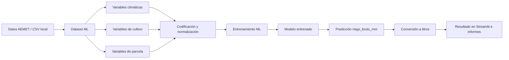
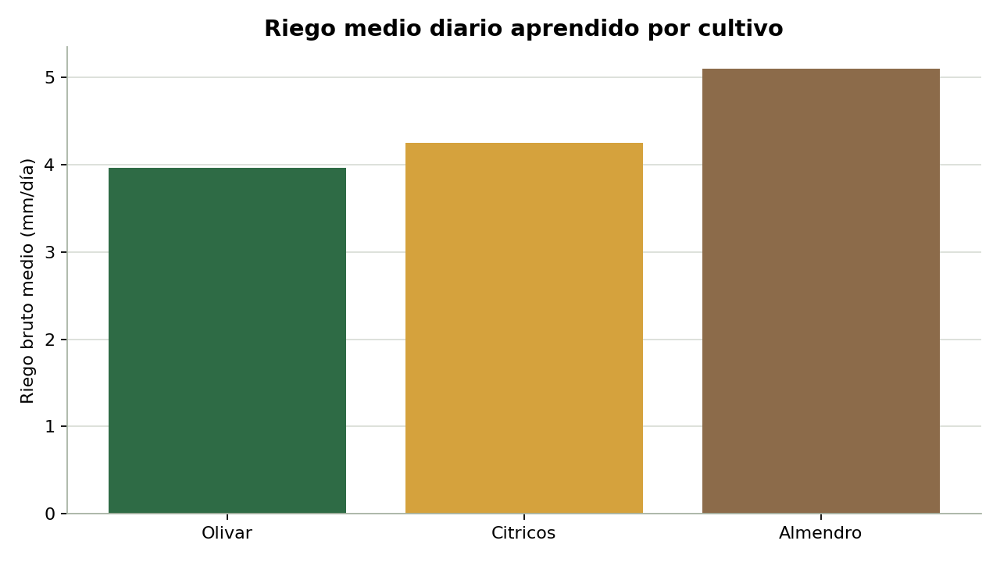
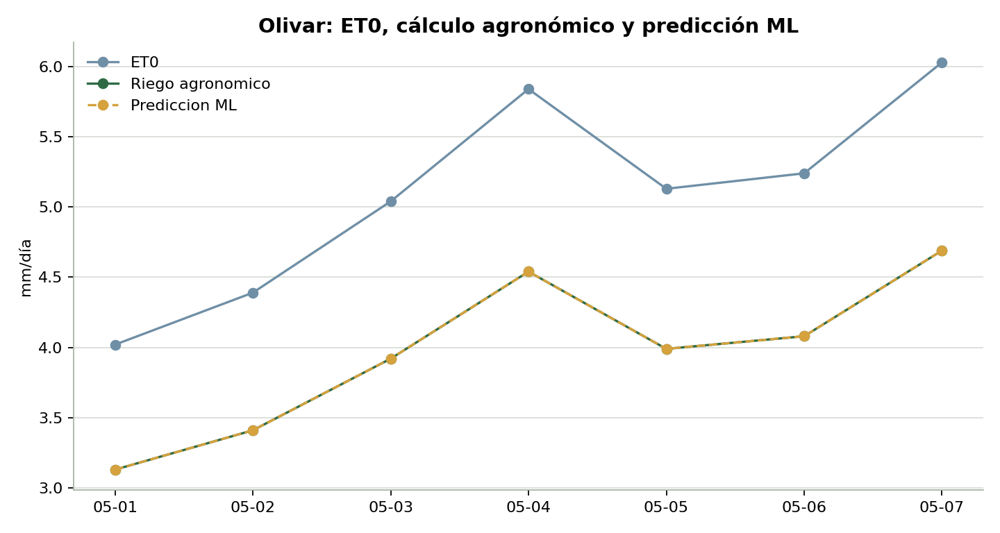
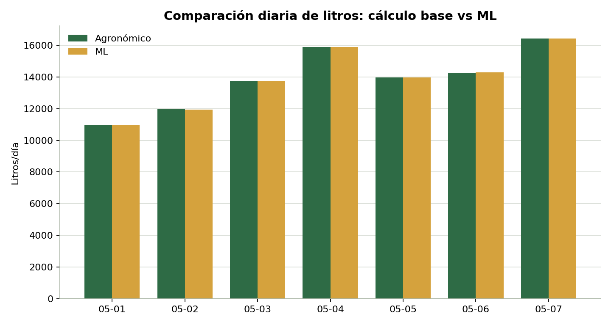
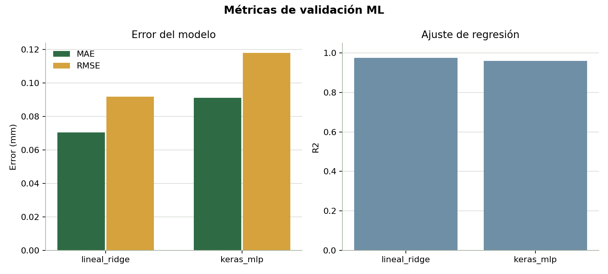

# Proceso completo de Machine Learning

Este apartado reúne las evidencias técnicas del proceso ML aplicado al proyecto: datos de entrada, variable objetivo, líneas de código relevantes, tablas de resultados, gráficas y capturas de la interfaz.

La finalidad es dejar documentado cómo se pasa de datos AEMET y variables de cultivo/parcela a una predicción de riego expresada en milímetros y posteriormente convertida a litros.

## 1. Flujo general



## 2. Variable objetivo

El modelo aprende a predecir:

```text
riego_bruto_mm
```

Esta variable representa la lámina de riego recomendada antes de convertirla a litros. La conversión final se realiza con la superficie de la parcela:

```text
litros_totales = riego_bruto_mm * superficie_m2
```

La etiqueta de entrenamiento se genera con el motor agronómico:

```text
ETc = ET0 * Kc
riego_neto = max(0, ETc - lluvia_efectiva)
riego_bruto = riego_neto / eficiencia_riego
```

Por tanto, el modelo actual aprende una referencia agronómica calculada. Para operación comercial validada, debería calibrarse con riegos reales aplicados en campo.

## 3. Trazabilidad de código

| Fase | Archivo | Líneas clave | Función dentro del proceso |
|---|---|---:|---|
| Definición de la variable objetivo | [`irrigation_advisor/ml.py`](../../irrigation_advisor/ml.py#L17) | 17 | Define `TARGET_FIELD = "riego_bruto_mm"`. |
| Construcción del dataset ML | [`irrigation_advisor/cli.py`](../../irrigation_advisor/cli.py#L487) | 487 | Genera el dataset desde datos AEMET, cultivo y parcela. |
| Generación de la etiqueta | [`irrigation_advisor/cli.py`](../../irrigation_advisor/cli.py#L1429) | 1429 | Escribe `riego_bruto_mm` en el dataset. |
| Entrenamiento general | [`irrigation_advisor/ml.py`](../../irrigation_advisor/ml.py#L107) | 107 | Selecciona backend `auto`, `keras` o `linear`. |
| Modelo lineal de respaldo | [`irrigation_advisor/ml.py`](../../irrigation_advisor/ml.py#L235) | 235 | Entrena el modelo `linear_ridge`. |
| Modelo Keras | [`irrigation_advisor/ml.py`](../../irrigation_advisor/ml.py#L274) | 274 | Entrena la red neuronal multicapa. |
| Arquitectura Keras | [`irrigation_advisor/ml.py`](../../irrigation_advisor/ml.py#L301) | 301 | Define capas densas de 32, 16 y 1 neurona. |
| Predicción | [`irrigation_advisor/ml.py`](../../irrigation_advisor/ml.py#L374) | 374 | Ejecuta inferencia y devuelve riego ML. |
| Integración en Streamlit | [`app.py`](../../app.py#L840) | 840 | Añade la predicción ML a la recomendación de la app. |

Fragmento principal de arquitectura:

```python
model = tf.keras.Sequential(
    [
        tf.keras.layers.Input(shape=(x_train.shape[1],)),
        tf.keras.layers.Dense(32, activation="relu"),
        tf.keras.layers.Dense(16, activation="relu"),
        tf.keras.layers.Dense(1),
    ]
)
```

## 4. Tablas de resultados

| Tabla | Ruta | Contenido |
|---|---|---|
| Variables ML | [`tablas/variables_ml.csv`](tablas/variables_ml.csv) | Variables usadas por grupo: localización, fecha, clima, cultivo, parcela y salida. |
| Resumen por cultivo | [`tablas/resumen_dataset_por_cultivo.csv`](tablas/resumen_dataset_por_cultivo.csv) | Filas, Kc medio, riego medio y litros medios por cultivo. |
| Comparación olivar | [`tablas/olivar_agronomico_vs_ml.csv`](tablas/olivar_agronomico_vs_ml.csv) | Comparación diaria entre cálculo agronómico y predicción ML. |
| Métricas de modelos | [`tablas/metricas_modelos.csv`](tablas/metricas_modelos.csv) | MAE, RMSE y R2 para modelo lineal y Keras. |

### Resumen por cultivo

| Cultivo | Filas | Kc medio | Riego medio (mm/día) | Litros medios/día |
|---|---:|---:|---:|---:|
| Almendro | 7 | 0,90 | 5,10 | 17.845,00 |
| Cítricos | 7 | 0,75 | 4,25 | 14.870,83 |
| Olivar | 7 | 0,70 | 3,97 | 13.879,44 |

### Métricas de validación

| Modelo | Target | MAE (mm) | RMSE (mm) | R2 | Filas validación |
|---|---|---:|---:|---:|---:|
| Linear Ridge | `riego_bruto_mm` | 0,0704 | 0,0918 | 0,9755 | 4 |
| Keras MLP | `riego_bruto_mm` | 0,0913 | 0,1180 | 0,9595 | 4 |

## 5. Gráficas del proceso ML

### Riego medio por cultivo



### Olivar: ET0, cálculo agronómico y predicción ML



### Litros diarios: cálculo base frente a ML



### Métricas de validación ML



## 6. Capturas relacionadas en Streamlit

| Captura | Ruta | Evidencia |
|---|---|---|
| Activación del modelo ML | [`../capturas/figura_02_modelo_ml_activado.png`](../capturas/figura_02_modelo_ml_activado.png) | La interfaz permite activar el modelo entrenado. |
| Resultados principales | [`../capturas/figura_03_resultados_principales.png`](../capturas/figura_03_resultados_principales.png) | Muestra la recomendación agronómica base. |
| Predicción ML | [`../capturas/figura_04_prediccion_ml.png`](../capturas/figura_04_prediccion_ml.png) | Muestra la salida ML comparable con el cálculo base. |
| Descarga de informes | [`../capturas/figura_05_descarga_informes.png`](../capturas/figura_05_descarga_informes.png) | Permite exportar la recomendación en Markdown o JSON. |

## 7. Lectura técnica

El comportamiento observado es coherente con el objetivo del prototipo:

- El modelo aprende la relación entre ET0, cultivo, Kc, eficiencia y riego bruto.
- Los cultivos con mayor Kc generan mayor demanda hídrica.
- La predicción ML se mantiene muy próxima al cálculo agronómico porque la etiqueta procede de dicho cálculo.
- El resultado no valida una explotación real en campo; valida la integración técnica del flujo ML.

## 8. Regeneración de evidencias

Las tablas y gráficas se regeneran con:

```powershell
python scripts/generate_ml_evidence.py
```

Entradas usadas:

- [`data/resultados/dataset_ml_aemet.csv`](../../data/resultados/dataset_ml_aemet.csv)
- [`data/resultados/prediccion_ml_olivar.md`](../../data/resultados/prediccion_ml_olivar.md)
- [`models/riego_predictivo/model.json`](../../models/riego_predictivo/model.json)
- [`models/riego_predictivo_keras/metadata.json`](../../models/riego_predictivo_keras/metadata.json)
